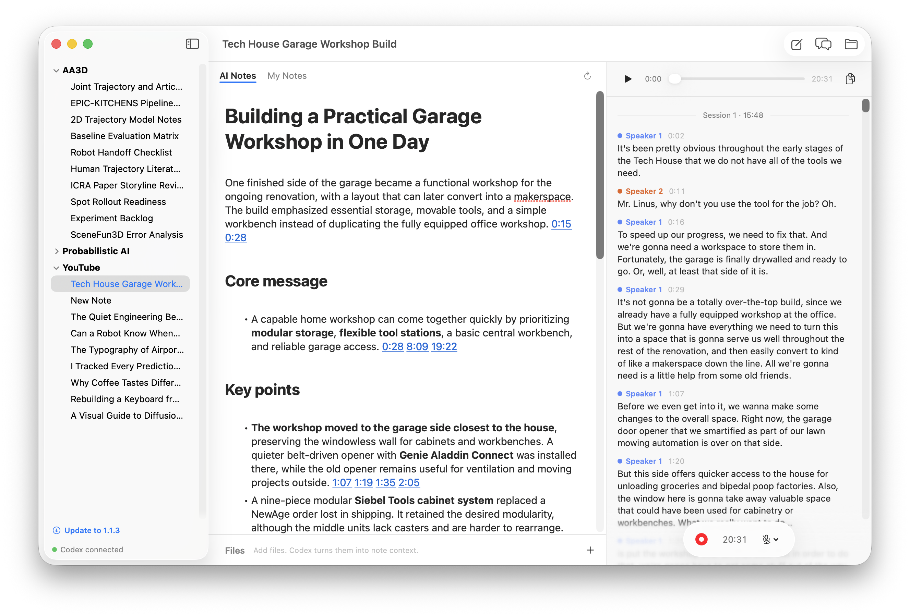
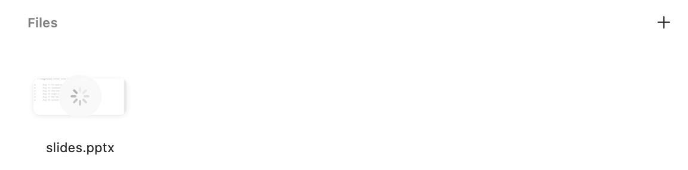
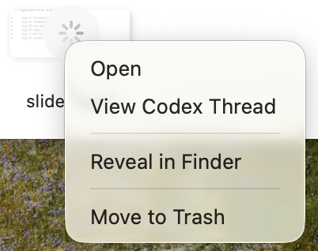
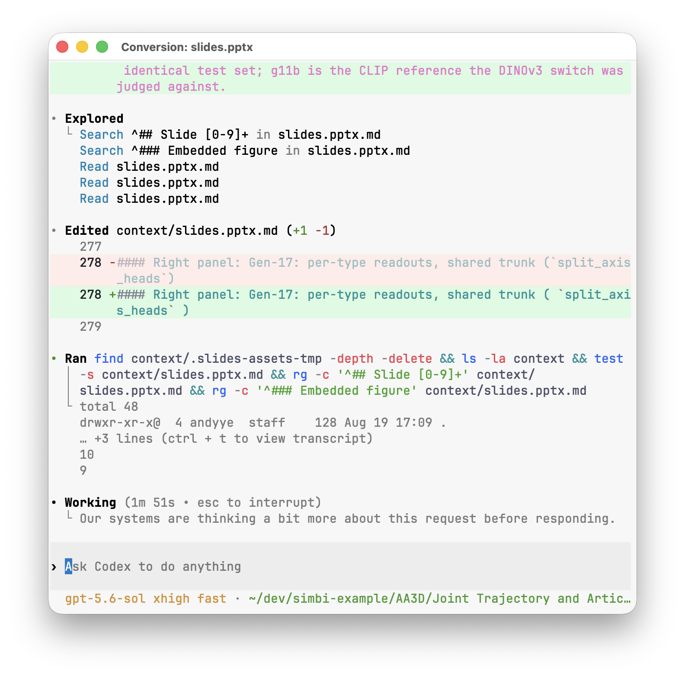
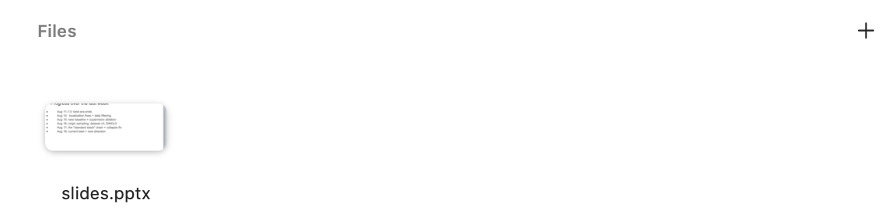
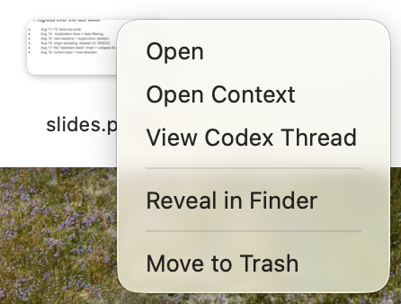
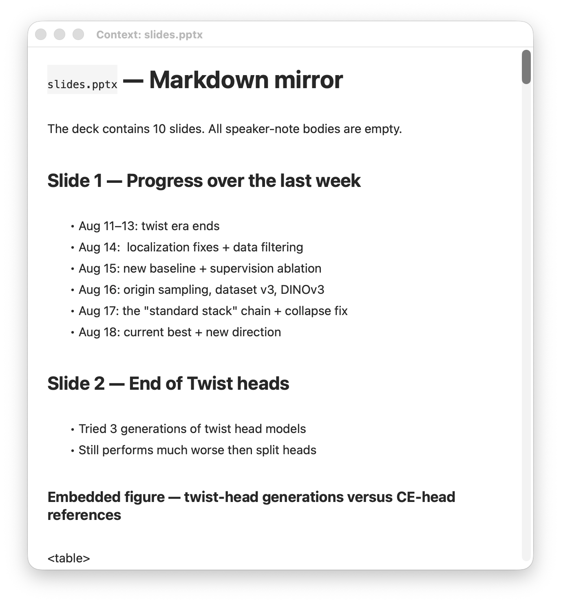

Attachments give Simbi more material to work with. Once a file is converted,
its contents can help the transcript fixer recognize names and terminology,
help AI Notes include relevant details, and give note chat another source to
answer from.

## Add a file

1. Open the note you want to add context to.
2. Click the **+** button on the right side of **Files**.
3. Choose one or more files from the file picker.

You can also drag files directly onto the Files section. Simbi copies each file
into the note, so the original file stays where it was and is not modified.

## While the file is converting

The file appears immediately. A spinner over its preview means Simbi is turning
it into readable context.

You can keep using the note while this runs. Right-click the file to open the
original, reveal it in Finder, or move it to Trash.

**View Codex Thread** opens the live conversion work in a separate window. This
is optional. You do not need to watch the thread for conversion to finish.

How conversion works

Simbi packages `anydoc` with the app and uses it as a first pass for common
formats such as PDF, PowerPoint, Word, Excel, CSV, EPUB, RTF, and OpenDocument.
Codex then checks the Markdown against the original, corrects the conversion,
and adds descriptions for useful figures or images when needed.

Each attachment gets its own conversion thread. Opening **View Codex Thread**
lets you see the files Codex reads and the changes it makes to the context.

The original attachment is kept unchanged. The conversion instructions come
from `INGEST.md` at the Simbi home root, so advanced users can customize how
future attachments are handled.

## Open the finished context

When the spinner disappears, the context is ready and the file returns to its
normal preview.

Right-click the file and choose **Open Context**.

Simbi opens the converted Markdown in a separate window. You can read it to
check what the AI features will see, or edit it to correct wording, restore a
missing detail, or add helpful context. Changes save automatically.

Double-clicking the file tile, or choosing **Open**, opens the original instead.
If a conversion fails, the tile shows a warning and its menu offers **Retry
Conversion**. Choosing **Move to Trash** removes both the copied attachment and
its converted context, using the macOS Trash so the files remain recoverable.
