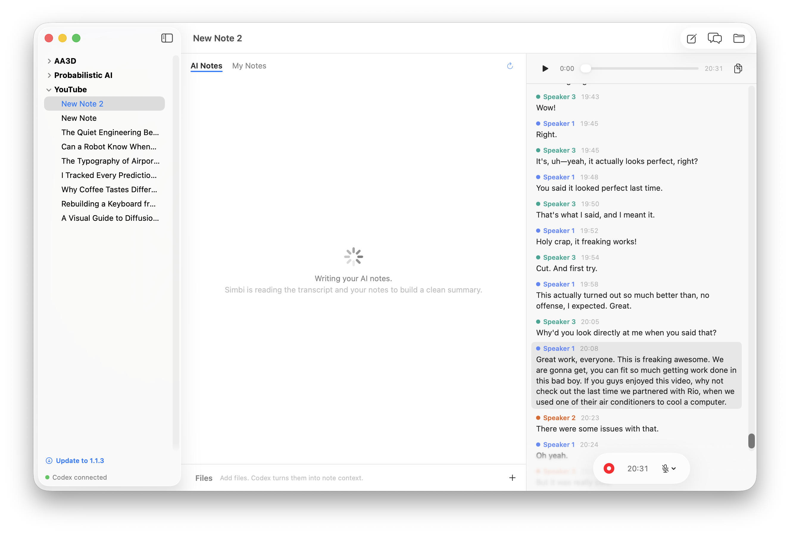
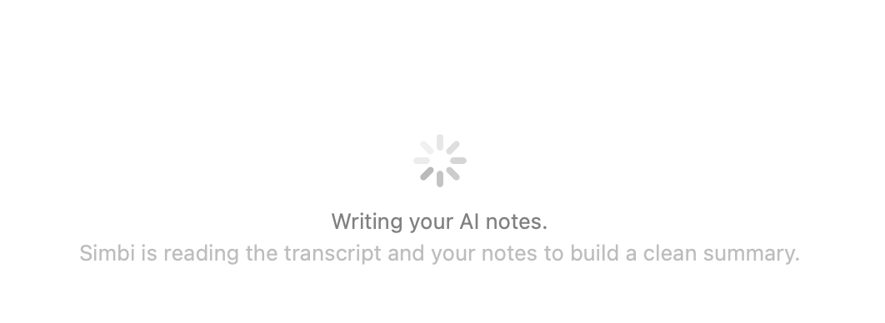
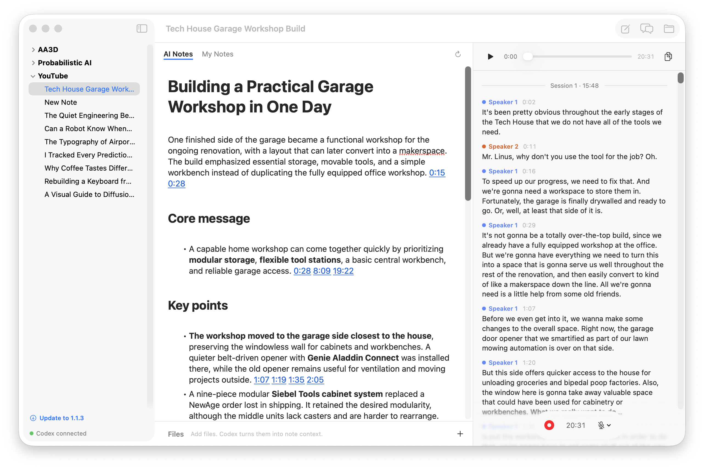
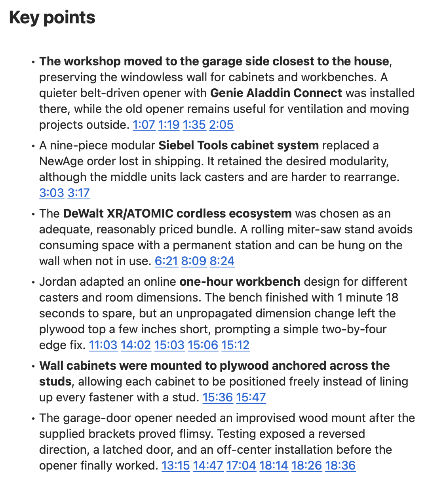
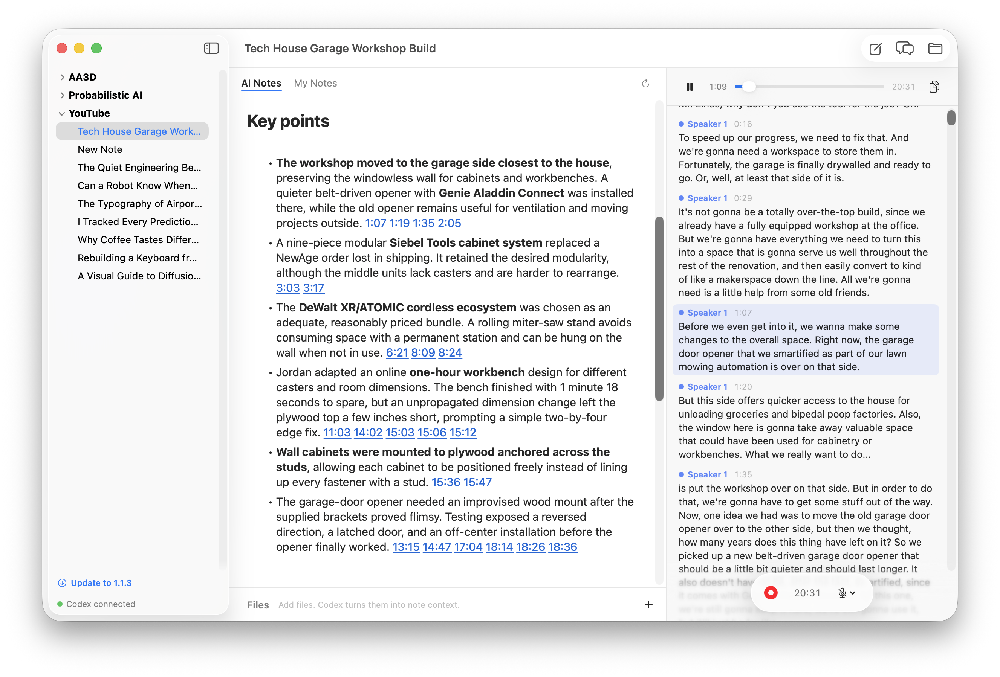
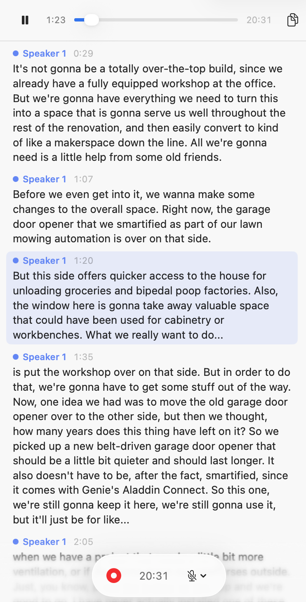
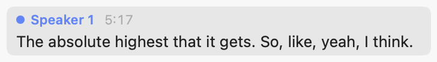
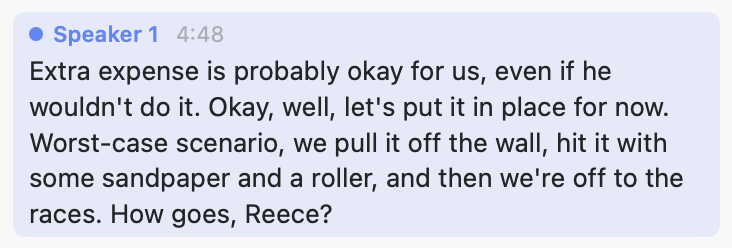

import AppIcon from '../../../components/AppIcon.astro';

When a recording stops, Simbi finishes the remaining transcript and then, when
enabled, creates AI Notes and proposes a title for a still-untitled note.

These features run only after recording has stopped, when the transcript has
content and Codex is connected.

## AI Notes

The first generation selects the **AI Notes** tab and displays a progress state.
The transcript remains available in the right pane while the summary is being
written.

Simbi reads your notes, transcript, and converted attachments. If AI Notes
already exist, Simbi also reads them so a later recording can be woven into the
existing summary.

The result is a concise note organized for the kind of recording Simbi finds,
such as a meeting, lecture, interview, presentation, or open discussion. It
removes conversational filler while preserving the substance of your notes.

You can edit AI Notes directly. After a later recording, Simbi updates them
while preserving your wording, additions, and ordering where possible.

The <AppIcon name="refresh" label="Regenerate AI Notes" /> button rebuilds AI
Notes from the source material. This replaces the current AI Notes, so any
manual edits are discarded.

You can customize this behavior by editing `SUMMARY.md` at the Simbi home root.
See [AI behavior is defined at the home root](/docs/how-simbi-stores-notes/#ai-behavior-is-defined-at-the-home-root).

## Timestamp citations

Every point derived from the transcript ends with one or more timestamp
citations.

Each blue timestamp is clickable.

Clicking a citation does two things:

1. Playback starts at that exact point in the audio.
2. The corresponding transcript line scrolls into view and receives a brief
   speaker-colored highlight.

## Automatic note titles

Simbi proposes a title only when the note still has a default name such as
`New Note` or `New Note 2`. A note that you have already named is never renamed
automatically.

It bases the title on your notes, transcript, and converted attachments. The
default policy chooses a short, specific title based on the subject rather than
the recording format. If that title already exists, Simbi adds a number, such
as `Project Review 2`.

Simbi applies the title after AI Notes and transcript cleanup finish. If you
rename the note first, your name wins.

The title policy comes from `TITLE.md` at the Simbi home root and can be edited
independently of `SUMMARY.md`.

## Transcript playback

When a note has recorded audio, the top of the transcript pane becomes a player.
It contains play or pause, the current time, a scrubber, the total duration, and
the copy-transcript button.

As audio plays, the matching transcript line receives a soft tint in its
speaker color. The transcript automatically scrolls to keep that line in view.

### Play from a transcript cue

Hovering a transcript row gives it a neutral gray background to show that the
row is interactive.

Click either a line's timestamp or its text to start playing from that moment.
Once playback reaches it, the row changes to its speaker-colored active tint.

Playback is unavailable while recording.

### Copy the complete WebVTT transcript

Click the <AppIcon name="copy" label="Copy transcript" /> button at the top right
of the player to copy the complete transcript as WebVTT. The copy includes the
latest transcription results and transcript-fixer edits.

The copied text includes timestamps and speaker labels, not just the words
visible in the pane. The button briefly becomes a checkmark after a successful
copy.
