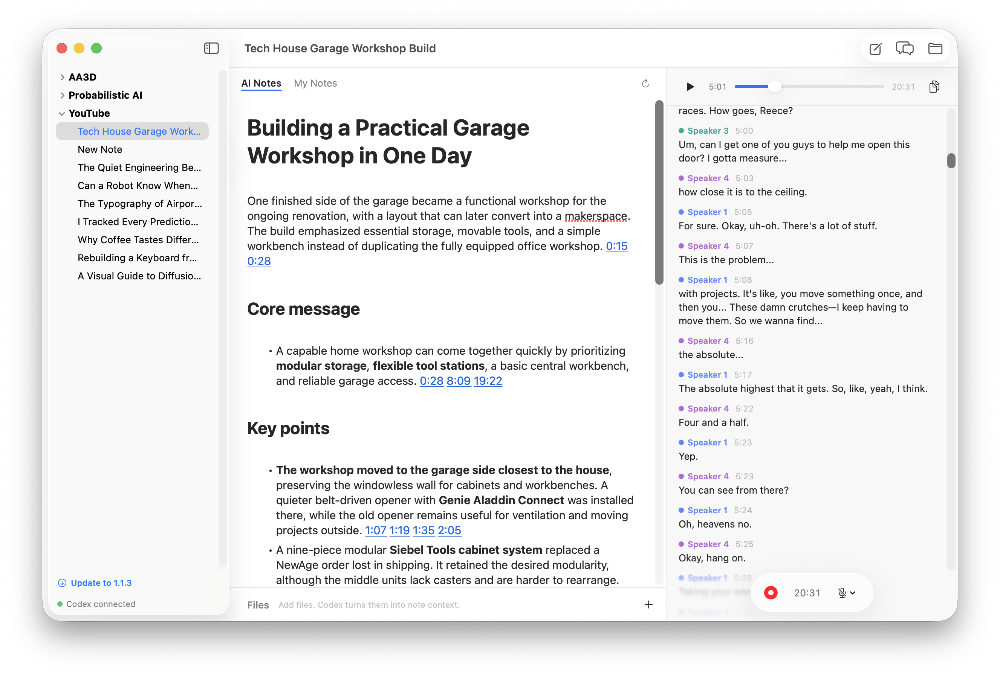
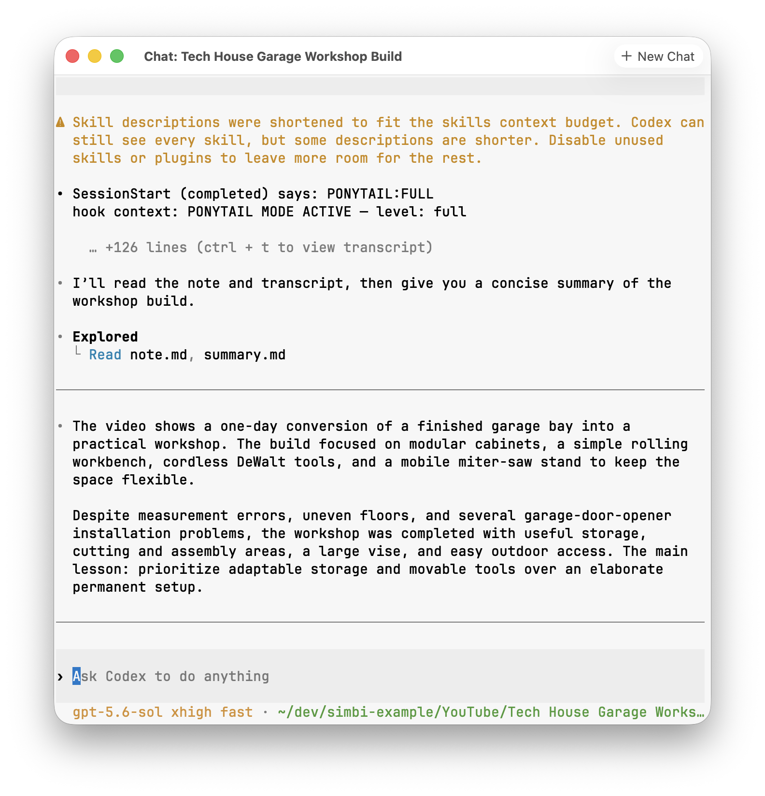

import AppIcon from '../../../components/AppIcon.astro';

Chat turns any note into a workspace with Codex. Open a note and click the
<AppIcon name="chat" label="Chat" /> button at the top right. Simbi opens a
separate Codex CLI window that is already attached to the selected note.

## Ask questions about a note

Codex can read your notes, AI Notes, transcript, and attachments. You do not
need to copy anything into the chat first. Ask a question naturally, and Codex
will open the relevant material before answering.

For example:

- "What decisions were made, and who owns each action item?"
- "When did they discuss the garage door measurements?"
- "Summarize the main disagreement between the speakers."
- "Compare the transcript with the attached slides and find anything missing."

## More than questions and answers

This is the full Codex CLI, not a read-only chat panel. It can edit the same
files that Simbi displays, so requested changes appear back in the app.

You can ask it to:

- Rename a speaker consistently throughout a transcript.
- Correct transcription mistakes or clean up AI Notes.
- Rewrite, shorten, expand, or reorganize a summary.
- Rename a note or change the order of notes in the sidebar.
- Cross-reference the current note with other notes in your Simbi library.
- Gather related notes into a new overview.
- Email notes or move them to Notion when the required integration is connected.

There is no fixed command list. If Codex can access the relevant files or a
connected service, you can describe the result you want in plain language.
External actions still follow the permissions and approvals shown by Codex.

## Work across notes

Each chat begins inside the selected note and focuses on its contents. If you
explicitly ask it to, Codex can also browse the rest of your Simbi library. This
makes questions such as "What did we decide about this last month?" or "Compare
this plan with the earlier project review" possible without manually opening
and copying from every note.

Naming the other note or folder in your request helps Codex find the right
material quickly.

## Start another chat

Click **New Chat** to begin a separate conversation about the same note. When
more than one chat is open, macOS groups them as tabs. This is useful when you
want one conversation for research and another for editing.

Clicking the Chat button in Simbi again returns you to the note's existing chat
window.

The starting instructions for note chat come from `CHAT.md` at the Simbi home
root. You can edit it if you want every new chat to follow different defaults.
See [AI behavior is defined at the home root](/docs/how-simbi-stores-notes/#ai-behavior-is-defined-at-the-home-root).
