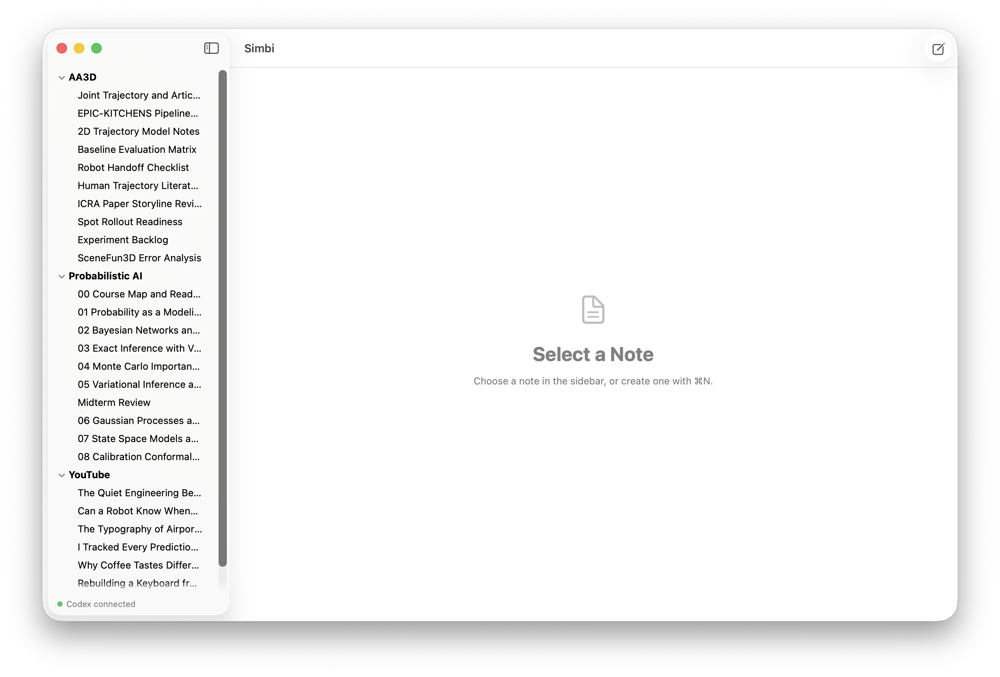
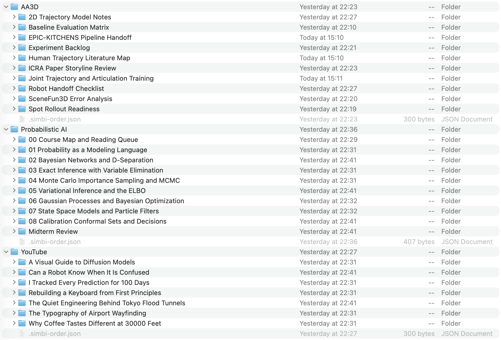
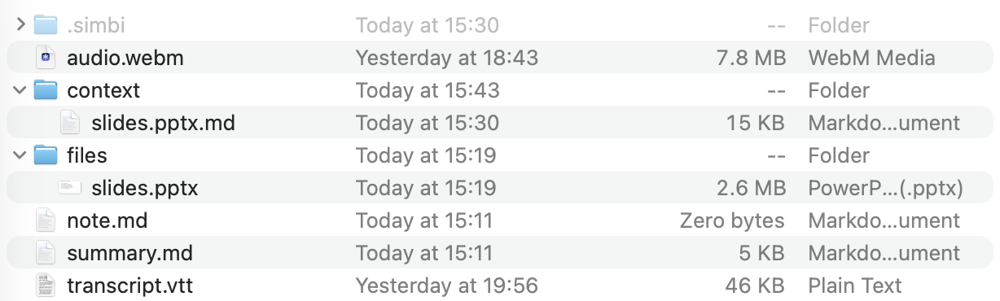

Simbi stores everything as ordinary files and folders. There is no separate
database or proprietary note format. By default, the home folder is `~/Simbi`,
but you can choose another folder in Settings.

## The sidebar is a folder tree

Simbi scans the home folder and mirrors its directory structure in the sidebar.
A folder that contains `note.md` is a **note folder**. It appears as a leaf in
the sidebar, so Simbi does not show its internal files and folders as children.

The file is named `note.md`, singular. Folders without `note.md` are
organizational folders and can contain more folders or notes. Note folders
cannot be nested inside other note folders.



_The Simbi sidebar shows organizational folders and note leaves._



_The same structure in Finder. Each note shown in Simbi is a real folder on
disk._

<details>
<summary>View an example folder tree</summary>

For example, the `AA3D` section in Simbi corresponds to this folder structure:

```text
Simbi/
└── AA3D/
    ├── Joint Trajectory and Articulation Training/
    │   └── note.md
    ├── Baseline Evaluation Matrix/
    │   └── note.md
    └── Robot Handoff Checklist/
        └── note.md
```

</details>

Renaming or moving a note changes the real folder on disk. Changes made in
Finder are also picked up by Simbi.

## Ordering with `.simbi-order.json`

Names alone do not determine the sidebar order. The home folder and any
organizational folder can contain a hidden `.simbi-order.json` file. Simbi
writes this file when you reorder items in the sidebar.

This means you can arrange notes however you want without adding numbers to
their names. Each folder keeps its own order, and dragging rows in Simbi updates
it automatically.

<details>
<summary>View the order file format and fallback rules</summary>

The format is a JSON array containing exact child names in display order:

```json
[
  "00 Course Map and Reading Queue",
  "01 Probability as a Modeling Language",
  "Midterm Review",
  "02 Bayesian Networks and D-Separation"
]
```

This lets `Midterm Review` appear between two numbered notes without renaming
its folder. Each folder has its own order file, so reordering one section does
not affect another.

The file is optional:

- With no order file, folders and notes appear before loose files, with each
  group sorted alphabetically.
- Listed names appear first in the stored order.
- Unlisted children follow in their normal default order.
- Names that no longer exist are ignored.
- New notes are placed at the top of their parent folder's order.

You normally do not need to edit this file yourself.

</details>

## Inside a note folder

A note folder can grow into the following structure:



Only `note.md` is required. Simbi creates the other entries when their features
are used.

Your writing, recording, transcript, and AI Notes live together in this folder.
Attachments have separate folders for the originals and the versions Codex can
read. A hidden folder holds Simbi's recovery and processing state.

<details>
<summary>View every file in a note folder</summary>

| Entry | Purpose |
| --- | --- |
| `note.md` | Your own Markdown note. Its presence also tells Simbi that this folder is a note. |
| `audio.webm` | The note's WebM/Opus recording. Multiple recording sessions are appended to one continuous file. |
| `transcript.vtt` | A WebVTT transcript with cue timing and speaker labels. Simbi updates it as transcription completes. |
| `summary.md` | AI Notes generated from `note.md`, the transcript, and converted context. Its presence makes the AI Notes tab appear. |
| `files/` | Unmodified copies of files you attach to the note. |
| `context/` | Markdown versions of attachments that Codex can read and use as context. |
| `.simbi/` | Private per-note bookkeeping for recording recovery, conversion jobs, and the transcript fixer. |

Because these are plain files, you can inspect, back up, search, or version them
with normal tools. Avoid manually editing `.simbi/`, which is app-managed state.

</details>

<details>
<summary>View the WebVTT transcript format</summary>

WebVTT is a standard text format for timed captions and transcripts. A small
Simbi transcript looks like this:

```text
WEBVTT

NOTE simbi note="Weekly Sync"

NOTE session 1 start=2026-08-19T10:00:00+09:00 offset=00:00:00.000

1
00:00:02.400 --> 00:00:05.100
<v Maya>Let's ship the beta on Friday.

2
00:00:05.300 --> 00:00:07.000
<v Leo>I'll finish the release notes.

NOTE session 1 end=2026-08-19T10:00:08+09:00 offset=00:00:08.000
```

`WEBVTT` is the required file header. Each cue has a numeric identifier, a
start and end timestamp, and its text. The `<v Maya>` voice tag identifies the
speaker.

Simbi uses valid WebVTT `NOTE` blocks for extra metadata. Session blocks mark
recording stop and resume boundaries. A `NOTE gap` block can mark audio that
contains no transcript cue, and a `NOTE continuation` block can identify a cue
that continues from an earlier segment. These blocks do not change the standard
cue format.

</details>

## Attachments: `files/` and `context/`

When you add an attachment, Simbi keeps an unmodified copy in `files/`. The
source file is not moved or changed.

Simbi also creates a readable Markdown version in `context/`. This lets the
transcript fixer, AI Notes, title generator, and note chat use the attachment
while keeping the original available for opening or sharing.

<details>
<summary>Attachment naming and conversion details</summary>

An existing attachment is never overwritten. If a name is already taken, Simbi
chooses a name such as `report 2.pdf`. The original and its readable Markdown
counterpart stay paired by name:

```text
files/slides.pptx
context/slides.pptx.md
```

The original remains available for opening or sharing. Its converted Markdown
provides readable text to the transcript fixer, AI Notes, note title generator,
and note chat. Conversions preserve the source content rather than replacing the
original with a summary.

Conversion status and its Codex thread ID are stored in the note's
`.simbi/state.json`. If the Markdown counterpart is missing, Simbi can dispatch
the conversion again.

</details>

## Inside a note's `.simbi/` folder

The hidden `.simbi/` folder holds private state used for recovery and background
processing. Simbi manages it automatically, so you should not need to open or
edit it.

<details>
<summary>View the internal folder contents</summary>

It is created as needed and can contain:

```text
.simbi/
├── state.json
├── pending/
│   ├── 42.webm
│   └── 42.json
├── failed/
└── fixer-worktree/
    └── transcript.vtt
```

- `state.json` tracks the next transcript cue number, recording sessions,
  audio duration, file-conversion jobs, and the transcript fixer's Codex thread
  and instruction version.
- `pending/` is a disk-backed transcription queue. Each pending cue has a small
  WebM audio segment and a JSON sidecar with its timing and speaker metadata.
  Simbi reloads this queue after a restart.
- `failed/` keeps segments that exhausted their transcription retries. Simbi
  writes `[inaudible]` into the transcript so the timeline can continue.
- `fixer-worktree/` holds a temporary copy of `transcript.vtt` for the transcript
  fixer. Simbi merges accepted speaker and text corrections into the live
  transcript while preserving cue numbers and timestamps.

This is different from the `.simbi/` folder at the **home root**, which stores
app-wide settings in `settings.json`.

</details>

## AI behavior is defined at the home root

Simbi creates a set of Markdown instruction files in the home folder. These
files define how each Codex-powered feature behaves. Simbi hides them from the
note list, but they remain visible in Finder:

| File | Controls |
| --- | --- |
| `AGENTS.md` | Shared layout knowledge and safety rules for agents working in the Simbi home. |
| `FIXER.md` | How the transcript fixer corrects recognition errors and speaker names. |
| `INGEST.md` | How attached files are converted into faithful Markdown context. |
| `CHAT.md` | The opening instructions and available context for note chat. |
| `SUMMARY.md` | How AI Notes combine your note, transcript, and converted context. |
| `TITLE.md` | How a default note name is replaced with a short content-based title. |

You can edit these files from the **Agent instructions** section in Settings or
open them directly in a text editor. Simbi creates defaults on first launch but
does not overwrite your edits. Changes apply the next time the corresponding
feature runs.

<details>
<summary>Instruction placeholders and fallback behavior</summary>

Changing `FIXER.md` causes Simbi to start a new fixer thread instead of resuming
one created with older instructions.

Two instruction files support placeholders that Simbi fills at runtime:

- `INGEST.md`: `{{ file }}` and `{{ anydoc }}`
- `CHAT.md`: `{{ note_path }}` and `{{ files }}`

Unknown placeholders are left visible instead of being silently removed. A
missing or blank instruction file falls back to Simbi's built-in default, and
Settings can reset any file to that default.

</details>
