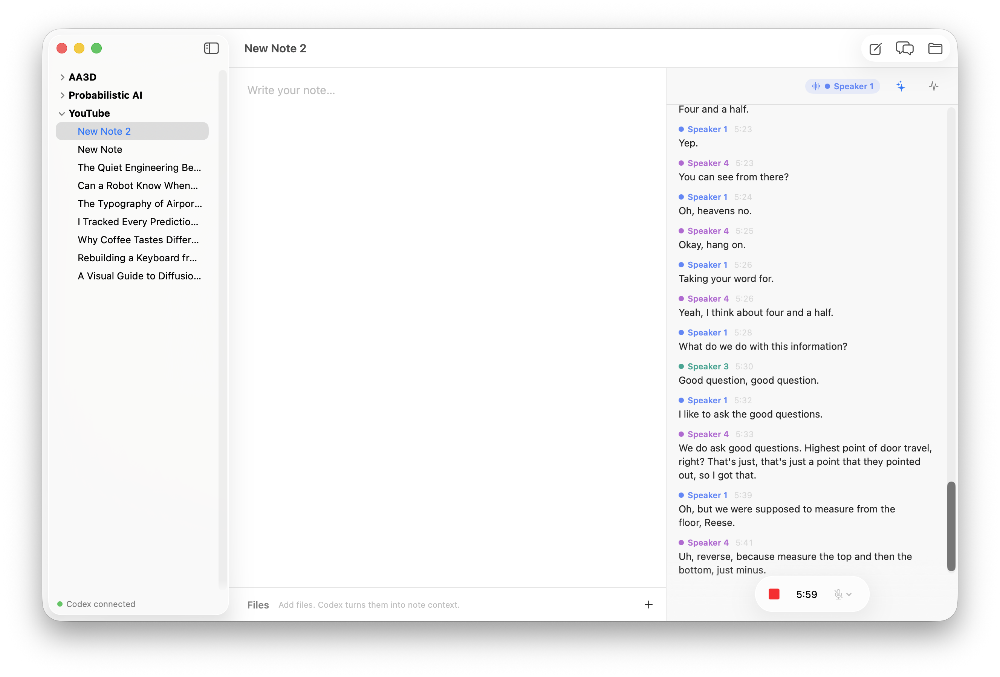
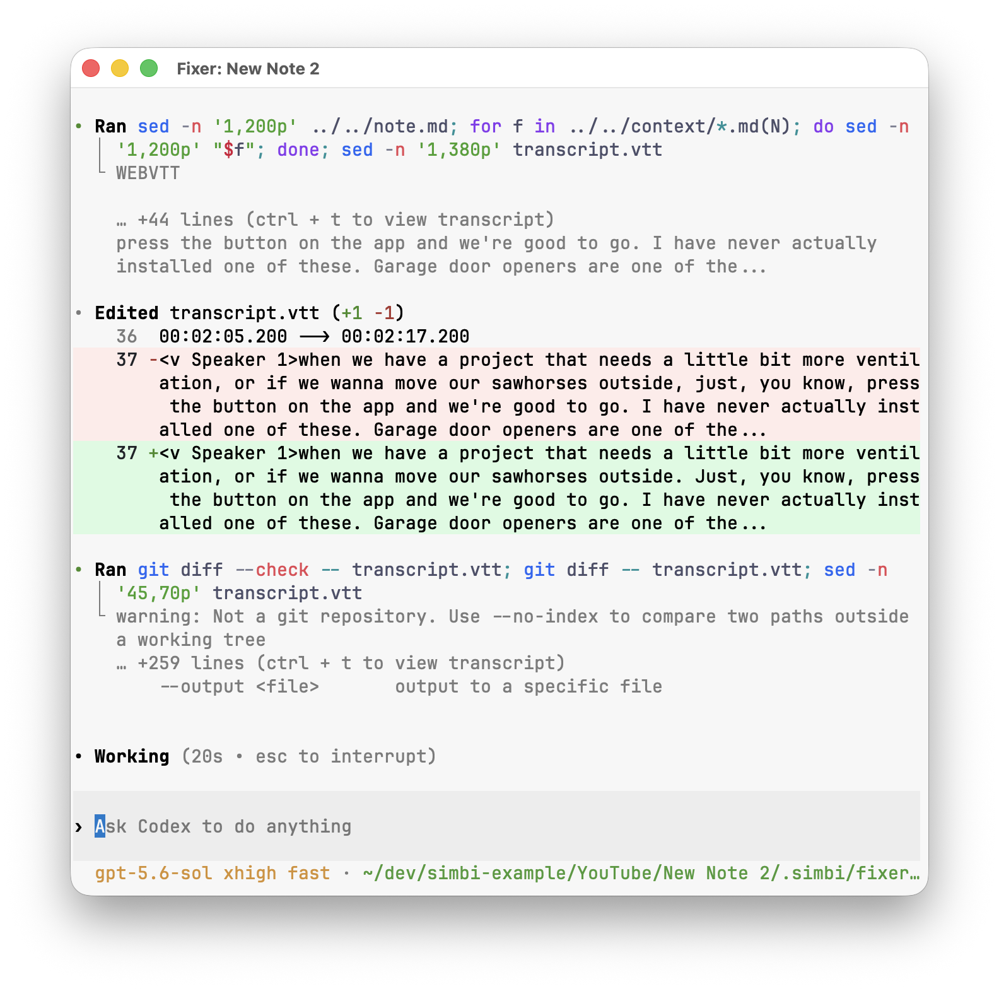
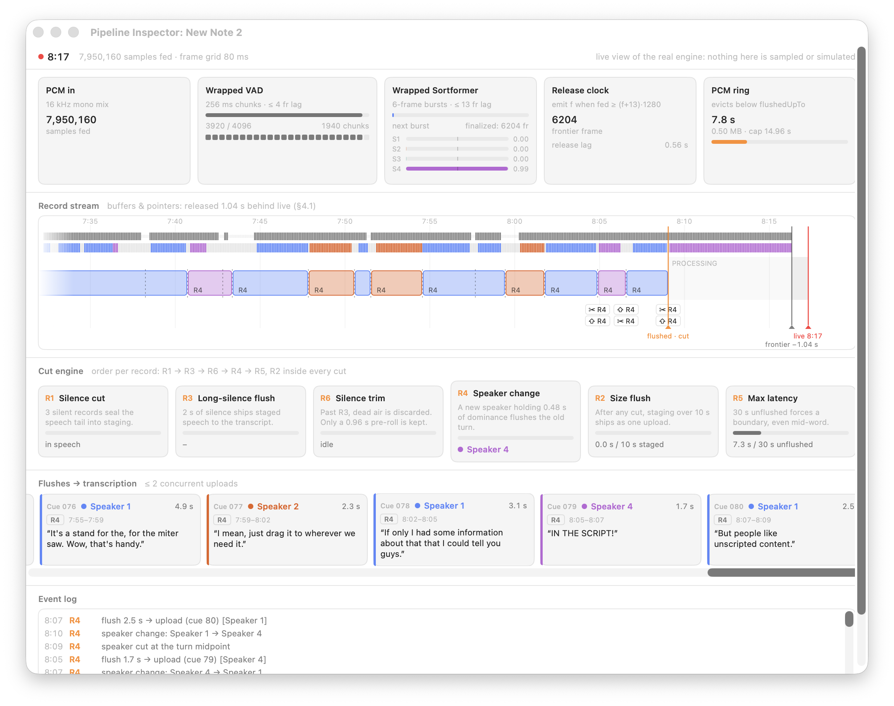

import AppIcon from '../../../components/AppIcon.astro';

While you record, Simbi turns microphone and system audio into a continuous
recording, a speaker-labeled transcript, and a stream of small segments that can
be transcribed without waiting for the recording to end.



The status strip at the top of the transcript has three live indicators:

1. The **speaker indicator** shows who the diarizer currently hears.
2. The <AppIcon name="fixer" label="Transcript fixer" /> button opens the transcript fixer's Codex thread.
3. The <AppIcon name="pipeline" label="Pipeline Inspector" /> button opens the Pipeline Inspector.

## The live speaker indicator

Simbi's diarizer tracks up to four speaker slots. The colored speaker pill shows
the most likely speaker for the newest tentative frame, or `Listening...` when
no speaker is active.

<details>
<summary>How speaker detection decides when a turn changes</summary>

This is immediate feedback, not a final transcript decision. The diarizer can
revise tentative output as more audio arrives. Simbi waits for finalized speaker
probabilities before it uses them to divide the recording into transcript cues.
A new speaker must remain dominant for 480 ms before the cut engine accepts the
change, which prevents a brief overlap or noisy frame from splitting the
conversation unnecessarily.

</details>

## The transcript fixer

Speech recognition works from short audio segments, so it can miss a name,
technical term, or punctuation that is obvious from the rest of the note. The
transcript fixer is a persistent, per-note Codex thread that reviews newly
appended cues with more context.

Click the <AppIcon name="fixer" label="Transcript fixer" /> button to watch that thread work. The icon pulses while a
pass is running and its tooltip reports whether the fixer is waiting, reviewing,
or done.



The fixer can correct transcript text and consistently rename a known speaker.
It does not change timestamps or move a line to a different diarized speaker.

<details>
<summary>How the fixer safely edits a live transcript</summary>

The fixer uses a snapshot-and-replay design so it never competes with the
recording pipeline for the live `transcript.vtt` file:

1. When one or more new cues have been appended, Simbi coalesces them into a
   single fixer pass.
2. Simbi copies the current transcript to
   `.simbi/fixer-worktree/transcript.vtt`. This copy is the fixer's only writable
   file.
3. The fixer reviews the requested cues. It can use `note.md` and Markdown files
   in `context/` as read-only ground truth for names and terminology.
4. When the pass finishes, Simbi compares the edited copy with the snapshot it
   supplied.
5. Simbi replays only valid changes to existing cue payloads onto the live
   transcript. This merge runs through the same single writer that appends new
   transcription results.

The fixer may correct cue text and consistently rename a known speaker. It
cannot change cue numbers or timestamps, create or delete cues, alter `NOTE`
blocks, or move one cue to a different diarized speaker. Simbi enforces these
rules during the merge and verifies that the result still parses as WebVTT
before writing it.

If more cues arrive during a pass, Simbi starts another coalesced pass afterward.
Stopping the recording requests one final pass. A fixer failure does not stop
recording or damage the live transcript.

</details>

The fixer's instructions come from `FIXER.md` at the Simbi home root. You can
edit that file to change its wording or correction policy. Simbi resumes the
same fixer thread across recording sessions, but starts a new one when the
instructions change. See [AI behavior is defined at the home root](/docs/how-simbi-stores-notes/#ai-behavior-is-defined-at-the-home-root).

## The Pipeline Inspector

Click the <AppIcon name="pipeline" label="Pipeline Inspector" /> button during a recording to open the Pipeline Inspector.
It is a live view of the real engine. The visualizer does not use sampled or
simulated data, and opening it does not change the cut decisions. When the
window is closed, the pipeline stops collecting the extra trace events.



The boxes across the top show audio entering the system and passing through
speech and speaker detection. The timeline shows how Simbi divides that audio,
the rule cards explain why each division happens, and the bottom rows show what
was sent for transcription.

<details>
<summary>Input analysis and timeline details</summary>

### Input and analysis

The five boxes across the top show how captured audio becomes a stream of
aligned 80 ms records:

| Box | Meaning |
| --- | --- |
| **PCM in** | The total 16 kHz mono samples received. When both sources are enabled, microphone audio is mixed with system audio and soft-clipped into this one stream. |
| **Wrapped VAD** | Voice activity detection in 256 ms chunks. Dark marks represent speech decisions and pale marks represent silence. A chunk is active at a probability of 0.85 or higher. |
| **Wrapped Sortformer** | Speaker diarization finalized in six-frame bursts. The S1 to S4 bars are the current probabilities for four speaker slots. The center marker is the 0.5 active threshold. |
| **Release clock** | The next 80 ms frame that can be released. A record advances only when both its VAD decision and finalized speaker probabilities are available. The fixed 13-frame delay is 1.04 seconds. |
| **PCM ring** | Recent raw audio retained in memory so a later cut can be encoded exactly. Audio before the `flushedUpTo` pointer is no longer needed and is evicted. |

Simbi also writes every incoming batch to the note's continuous `audio.webm`.
The ring buffer is only the short-lived working copy used to construct
transcription segments.

### The record stream

The large timeline shows roughly the last 45 seconds:

- The first thin lane shows VAD speech and silence decisions.
- The second thin lane colors each frame by its dominant speaker slot.
- **STAGING** lies between the orange `flushed` pointer and the black `cut`
  pointer. It has a boundary but has not necessarily been sent yet.
- **PROCESSING** lies between `cut` and the gray `frontier`. These released
  records are still being considered by the cut engine.
- **FINALIZING** lies between the frontier and the red live head. The models
  have not finalized this audio yet.
- Colored blocks are segments sent for transcription. Dashed lines mark cuts,
  hatched blocks are discarded silence, scissors badges mark cuts, and upward
  arrows mark flushes.

The gray frontier normally sits 1.04 seconds behind the live head because the
pipeline waits for finalized model output. The orange and black pointers can
coincide, shown as `flushed · cut`, when there is no staged segment waiting.

</details>

<details>
<summary>The six cut rules in detail</summary>

### The six cut rules

The cut engine is a pure, deterministic state machine. It consumes one aligned
record at a time and applies the rules in a fixed order. The cards show each
rule's current counter and threshold.

| Rule | Decision |
| --- | --- |
| **R1, Silence cut** | Three silent records, 240 ms, seal the preceding speech into staging. It never creates a cut for leading or already-flushed silence. |
| **R3, Long-silence flush** | After 2 seconds of silence, staged speech is sent toward transcription. |
| **R6, Silence trim** | After that long pause, old dead air is discarded while 0.96 seconds of pre-roll is retained in case speech resumes. |
| **R4, Speaker change** | A different speaker must dominate for 480 ms. Simbi then closes the old turn at the best available boundary and flushes it. |
| **R2, Size flush** | After any cut, more than 10 seconds of staged audio is sent as one segment. This check runs inside every cut operation. |
| **R5, Max latency** | At 30 seconds without a flushable boundary, Simbi forces a cut and upload, even if that point is mid-word. |

The **Flushes to transcription** row shows each encoded cue, its speaker,
duration, triggering rule, upload state, and returned text. Simbi permits at
most two uploads at once. The event log underneath gives the same decisions in
chronological form.

</details>

<details>
<summary>View concise pipeline pseudocode</summary>

```text
for each captured audio batch:
    mix sources into 16 kHz mono PCM
    append PCM to audio.webm and the short PCM ring
    send PCM to VAD and Sortformer

    while both models have finalized the next 80 ms frame:
        record = align(VAD verdict, speaker probabilities)

        for each flush from cutEngine.push(record):
            segment = PCM ring[flush.start .. flush.end]
            persist segment audio and metadata in .simbi/pending
            reserve its cue position in the ordered transcript outbox
            enqueue transcription, with at most two uploads in flight

when a transcription finishes:
    fulfill its reserved cue with the returned text
    append every ready cue at the front of the outbox to transcript.vtt
    notify the fixer about each newly appended cue

when recording stops:
    drain delayed model output, flush remaining speech, and finish audio.webm
    wait for the ordered outbox, then run the fixer's final pass
```

</details>

<details>
<summary>How ordering and recovery work</summary>

Before an audio segment is uploaded, Simbi writes its WebM data and a JSON
sidecar to `.simbi/pending/`. If the app quits, those files can be loaded again
in cue order. Transcription requests are retried up to three times. An
authentication problem pauses the disk-backed queue so recording can continue.

Uploads may finish out of order, but the transcript outbox reserves their cue
positions before they start. It appends only from the front of the queue, so
`transcript.vtt` always remains valid and chronological. A segment that exhausts
its retries moves to `.simbi/failed/`, and `[inaudible]` fills its place so later
cues are not blocked.

The continuous `audio.webm` remains the complete recording even when silence is
trimmed from transcription uploads or a segment cannot be transcribed.

</details>
