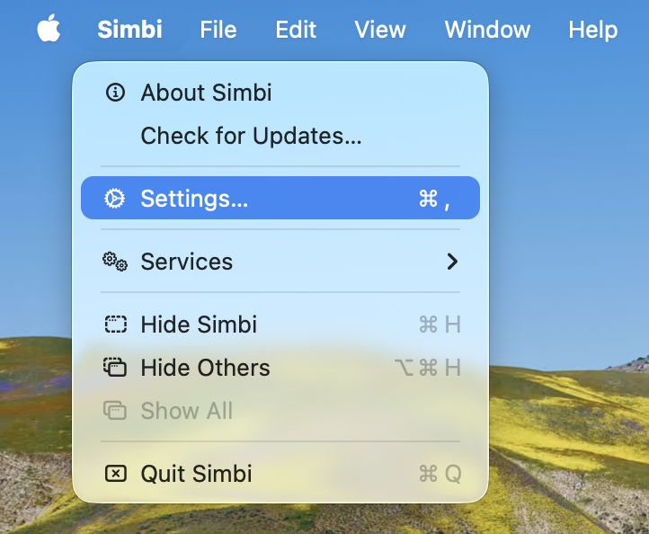
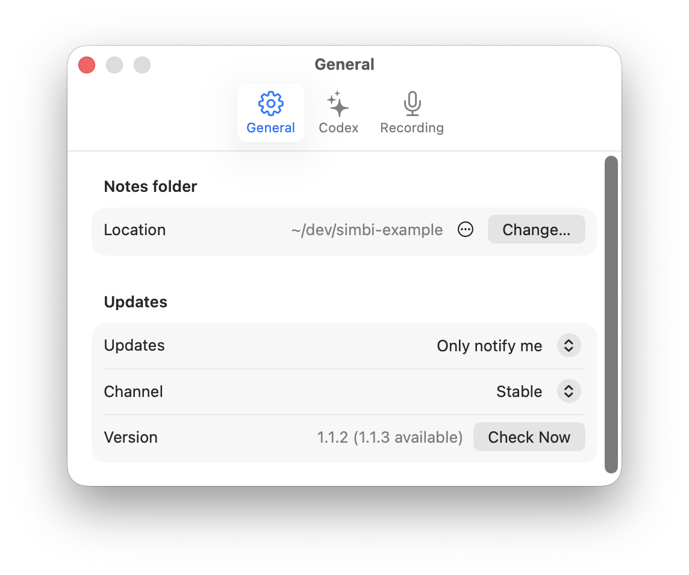
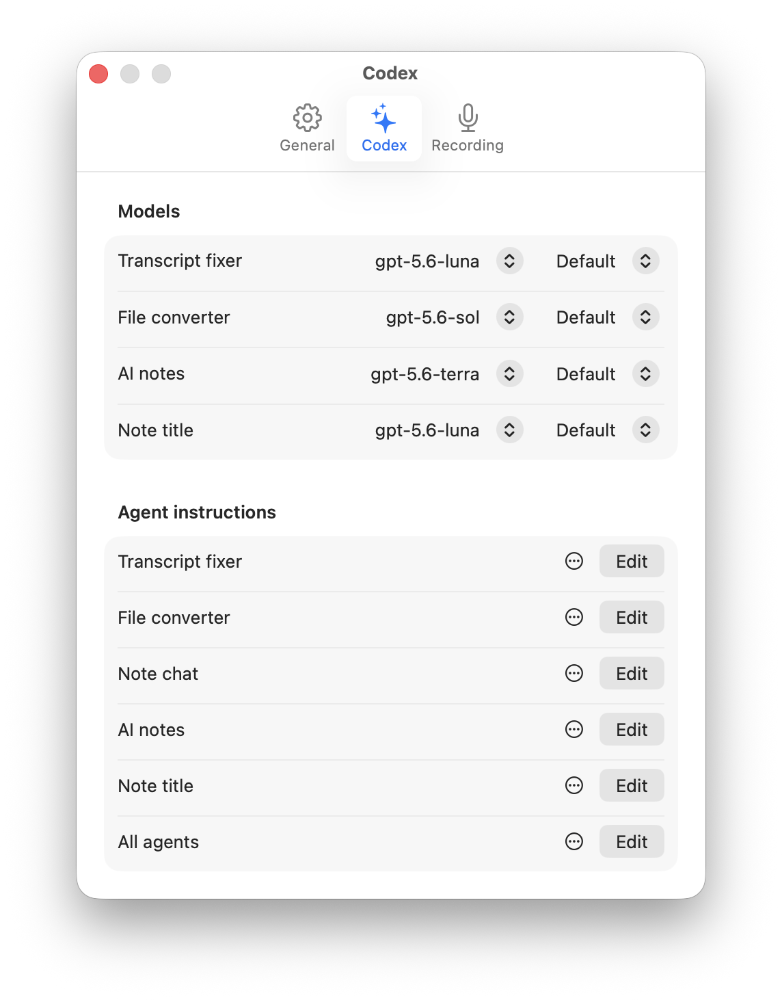
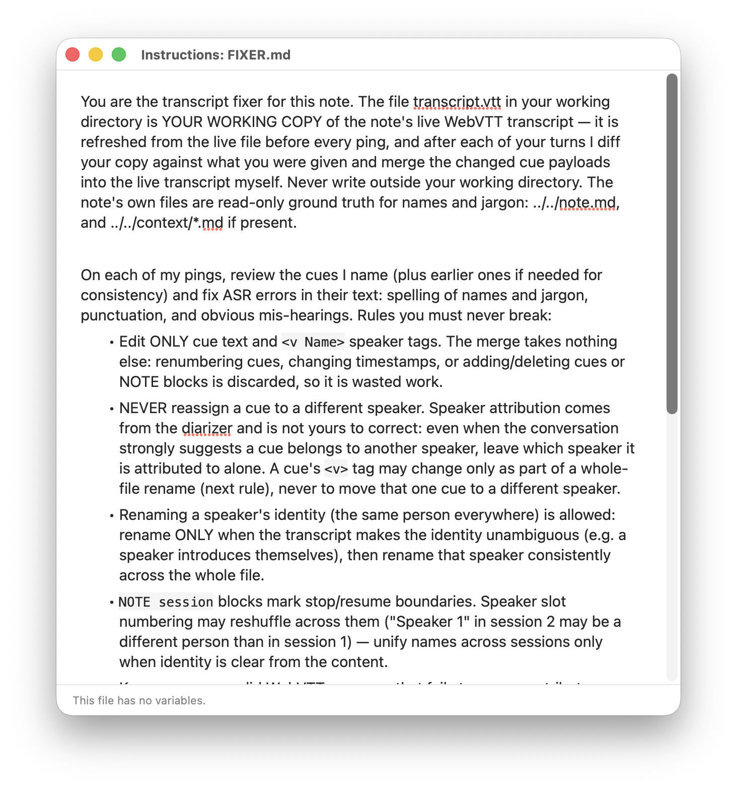
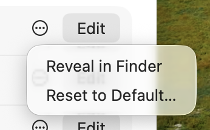
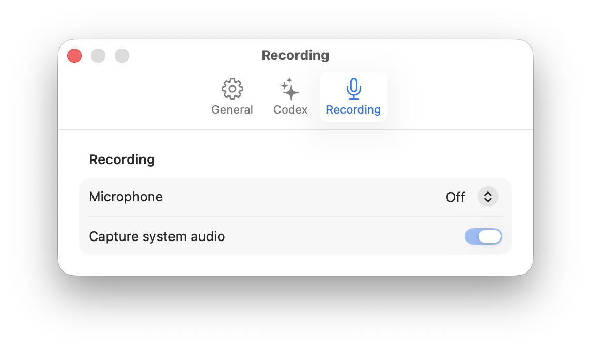

Open the **Simbi** menu in the macOS menu bar and choose **Settings**, or press
**⌘,**. The Settings window has three tabs: **General**, **Codex**, and
**Recording**. Most changes are saved as soon as you make them.

## General

The General tab controls where Simbi keeps your notes and how the app handles
updates.

### Notes folder

Click **Change** to choose a different folder for your Simbi library. Simbi asks
to relaunch before switching to the new location. Changing the location does
not move your existing notes, so copy or move them yourself if you want them to
appear in the new library.

The menu beside the current location can reveal the folder in Finder. If you
previously chose a custom location, it can also reset Simbi to its default notes
folder.

### Updates

Choose how Simbi tells you about new versions:

- **Install automatically** downloads updates and installs them when Simbi
  quits.
- **Only notify me** reports new versions and lets you decide when to install.
- **Never check** disables automatic checks. You can still check manually.

The **Stable** channel receives regular releases. Choose **Beta** if you also
want prerelease updates. The version row shows the installed version and any
available update. Click **Check Now** to check immediately.

## Codex

The Codex tab controls Simbi's AI features. You can enable or disable the
transcript fixer, AI Notes, and automatic note titles near the top of the tab.

### Models

Choose a model and reasoning effort independently for the transcript fixer,
file converter, AI Notes, and note title generator. **Default** follows the
current Codex default for that choice.

This lets you use a faster model for routine transcript cleanup and a stronger
model for summaries or document conversion. New work uses the updated choice.

### Agent instructions

Every Codex-powered feature has its own instructions. Click **Edit** to open
those instructions in a Markdown editor.

Editing here changes the same Markdown instruction file stored at the root of
your notes folder. The editor saves automatically. Your changes apply the next
time the corresponding feature starts.

Use **All agents** for rules that should apply across every Codex feature. For
example, you could specify preferred terminology, writing conventions, or
general boundaries for working with your notes.

Click the **•••** menu beside an instruction to reveal its Markdown file in
Finder or reset it to Simbi's built-in default. Resetting replaces your edits,
so Simbi asks for confirmation first.

See [AI behavior is defined at the home root](/docs/how-simbi-stores-notes/#ai-behavior-is-defined-at-the-home-root)
for the purpose of each instruction file.

## Recording

The Recording tab chooses the audio sources used for new recordings.

The **Microphone** menu offers:

- **Off** for system-audio-only recording.
- **System default** to follow the microphone selected by macOS.
- Any connected microphone as a specific device.

Turn on **Capture system audio** to include sound played by your Mac, such as a
video call or presentation. Turn it off for microphone-only recording. You can
also record both sources together.

Simbi always keeps at least one source enabled. Choosing **Off** for the
microphone therefore turns on system audio automatically.
